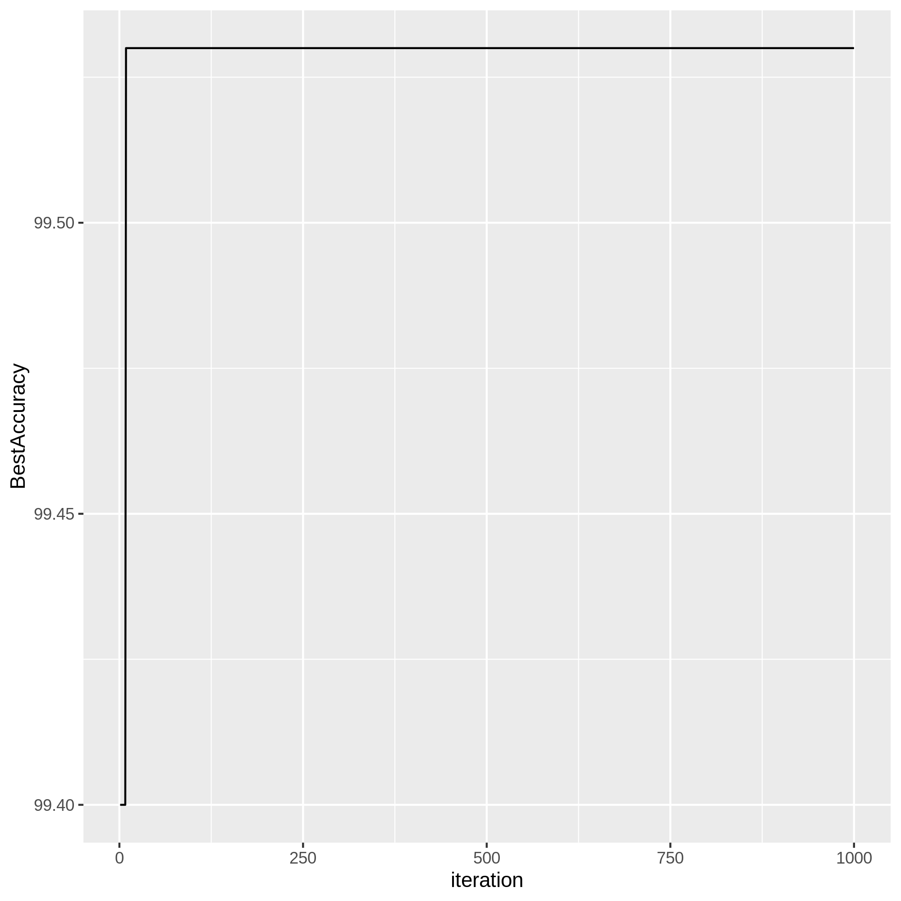

# Parameter Optimization of SVM using Randomization in R

This project is an implementation of Support Vector Machine (SVM) algorithm using parameter optimization with randomization in R programming language.

## About SVM

SVM is a powerful machine learning algorithm used for classification and regression analysis. It works by finding the best hyperplane that separates the data into different classes. The optimization of parameters is an essential step in SVM, as it helps to improve the accuracy of the model.

## About Parameter Optimization using Randomization

Parameter optimization is the process of selecting the optimal set of parameters for a given algorithm to achieve the best performance. Randomization is a technique used to generate random values for the parameters to find the best combination of parameters that result in the best model performance. In this project, we will use randomization to optimize the parameters of SVM.

## Parameters Optimized

The following parameters are optimized in this project:

- **nu:** the parameter that controls the number of support vectors used in the model.
- **kernel:** the kernel function used for the SVM algorithm.
- **epsilon:** the margin of error allowed in the SVM algorithm.

## Result

## Conclusion

In conclusion, this project provides an implementation of SVM with parameter optimization using randomization in R. The use of randomization helps to find the best combination of parameters that results in the best model performance. You can use this project as a starting point to develop more sophisticated SVM models for classification and regression analysis.
